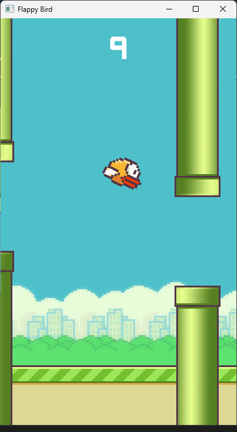

# Flappy Bird (C++ / SFML)



Implementación de **Flappy Bird** desarrollada en **C++ (GNU++17)** utilizando la librería **SFML 3.x**.  
Este proyecto está pensado como un **juego funcional**, una **base arquitectónica limpia** y un **ejercicio serio** de desarrollo gráfico en C++ usando **Visual Studio Code + MinGW**, sin depender inicialmente de CMake.

---

## 📌 Características

- Juego 2D en C++ puro  
- Renderizado y ventana con SFML  
- Arquitectura modular (`.cpp` / `.h`)  
- `main.cpp` minimalista  
- Soporte para **Debug** y **Release**  
- Compilación y ejecución mediante **VS Code Tasks**  
- Configuración explícita de IntelliSense (`c_cpp_properties.json`)  

---

## 📁 Estructura del proyecto

```
project/
├── src/
│   ├── Bird.cpp
│   ├── Bird.hpp
│   ├── Config.hpp
│   ├── Game.cpp
│   ├── Game.hpp
│   ├── main.cpp
│   ├── Obstacle.cpp
│   ├── Obstacle.hpp
│   ├── Parallax.cpp
│   ├── Parallax.hpp
│   ├── UISound.cpp
│   └── UISound.hpp
├── bin/
│   ├── app_debug.exe
│   ├── app_release.exe
│   ├── sfml-system-3.dll
│   ├── sfml-window-3.dll
│   ├── sfml-graphics-3.dll
│   └── resources/
├── .vscode/
│   ├── tasks.json
│   └── c_cpp_properties.json
├── resources/
│   ├── font/
│   ├── sounds/
│   └── sprites/
├── README.md
└── LICENSE
```

---

## 🛠 Requisitos

### Sistema
- Windows 10 / 11 (64-bit)

### Herramientas
- **MinGW-w64 (GCC)**  
  ```
  C:\mingw64\bin\g++.exe
  ```

- **SFML 3.x (MinGW 64-bit)**  
  ```
  C:\SFML-3.0.2\
  ```

- **Visual Studio Code**
  - Extensión: *C/C++ (Microsoft)*

---

## ⚙️ Configuración de VS Code

### `.vscode/c_cpp_properties.json`

Este archivo configura **IntelliSense**, autocompletado y navegación de código en VS Code.

```json
{
  "configurations": [
    {
      "name": "Win64",
      "includePath": ["C:\\SFML-3.0.2\\include"],
      "compilerPath": "C:\\mingw64\\bin\\g++.exe",
      "cppStandard": "gnu++17",
      "intelliSenseMode": "windows-gcc-x64"
    }
  ],
  "version": 4
}
```

---

## ▶️ Compilación y ejecución

Usa los **Tasks de VS Code**:

```
Ctrl + Shift + P → Run Task
```

Tasks disponibles:

- Build Debug (SFML)
- Build Release (SFML)
- Build + Run Debug (SFML)
- Build + Run Release (SFML)

---

## 📜 Licencia

**GNU AFFERO GENERAL PUBLIC LICENSE (AGPL v3)**  
Consulta el archivo `LICENSE` para más información.

---

## 🚀 Estado del proyecto

🔧 En desarrollo  
📌 Base estable para expansión futura
